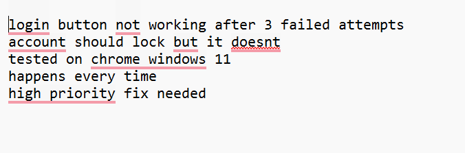
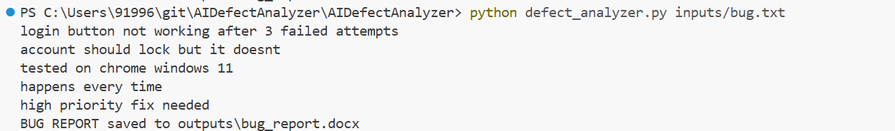
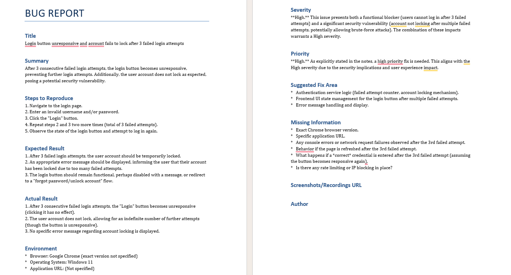

# 🤖 AI-Powered Defect Analyzer
> Automatically analyzes defects and generates structured bug report from any input document
> using the Gemini AI API — saving QA engineers hours of manual work.

## The Problem
As a Senior QA Engineer, I spend more than 15 minutes writing 
a single detailed bug report - formatting, structuring, 
finding the right words, ensuring nothing is missed.

## The Solution
I type 3-4 quick sentences about the bug I found.
The tool converts it into a complete professional bug report
in Word document format in seconds.

## How this tool Works

1. Drop your bug note into `/inputs` folder in a text file.
2. Run the script - Script contains the prompt to be used by the AI agent.
3. AI agent reads the bug note, execute the prompt, and generate a structured bug report.
4. Get a structured bug report in `/outputs`

## Result
1. Generated a well structured report under 30 seconds
2. Generated an structured bug report in word document with all the relevent fields which is Ready to Use for a QA Engineer after a quick review.

## ⚡ Before vs After

| | Manual Testing | This Tool |
|---|---|---|
| Time to write bug report | 20-30 minutes | Under 30 seconds |
| Steps to Reproduce | Written manually | Auto-generated |
| Missing info flagged | Often missed | Automatically flagged |
| Severity assessment | Subjective | AI reasoned |

## How to Run it?

```bash
pip install -r requirements.txt
python defect_analyzer.py inputs/bug.txt
```

## Screenshots

### Input - Requirements Document


### Tool Running


### Output - Generated Bug Report


## Project Structure

```
AIDefectAnalyzer/
├── inputs/                 (bug note to be considered by the AI agent)
├── outputs/                (output bug report in word file)
├── screenshots/            (screenshots for README)
│   ├── bugnote.png
│   ├── terminal_output.png
│   └── bug_report.png
├── .gitignore              (files that not need to be pushed to Github)
├── config.py               (loads the key safely)
├── defect_analyzer.py      (main script - reads bug note and generates bug report)
├── requirements.txt        (Python packages to install)
└── README.md               (Details about this tool)
```

## Technologies
Python · Gemini API · GenAI · PythonDOCX · python-dotenv

## Future Improvements
- Support for bulk bug reports (multiple inputs at once)
- Automatic severity classification based on bug patterns
- Integration with Jira to auto-create tickets
- HTML report output option

## Author
Mini Mariya Thomas
